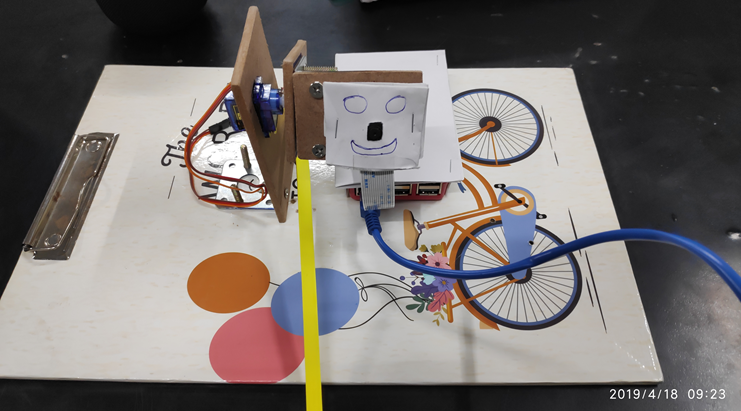
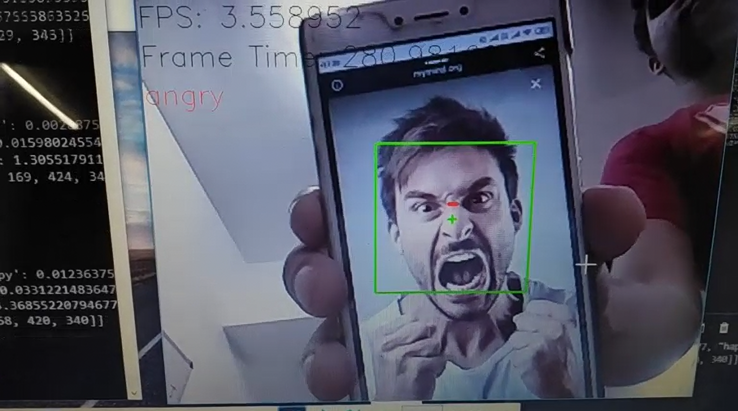
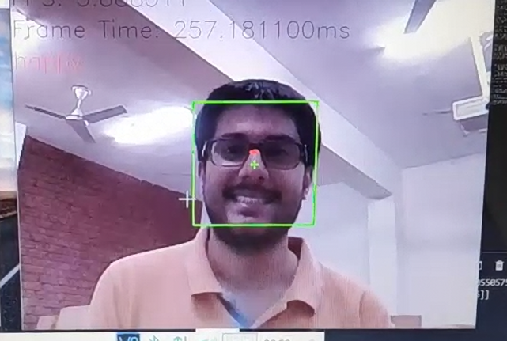
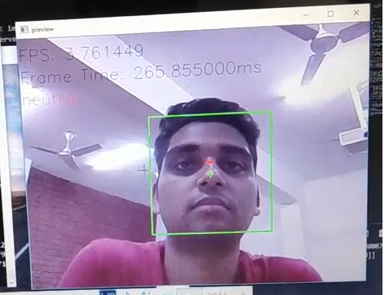
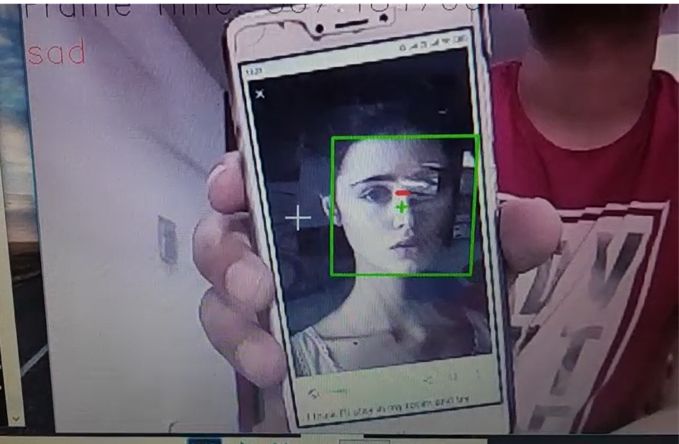
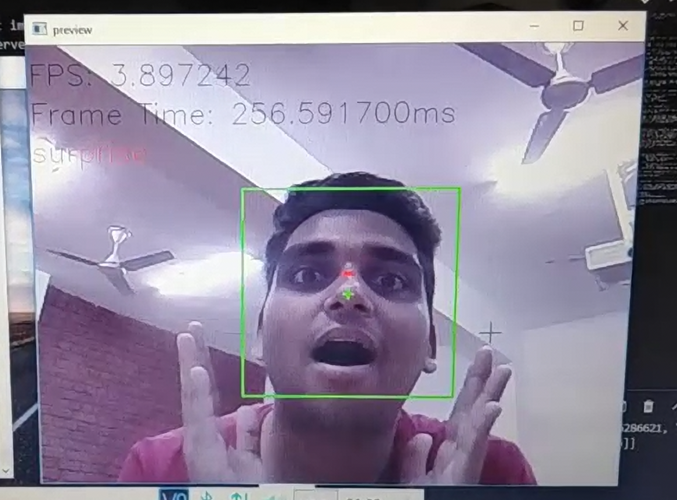

# RoboticsProject - ExpressionReactionRobot
This repo. contains the client and server code for a facial expression reaction robot which detects the facial expression of a person visible to a Raspberry Pi's camera and speaks a configured dialog using TTS via a speaker connected to the Raspberry Pi.

The client code runs on a Raspberry Pi which communicates to the server over the network. The server code runs on a computer with powerfull hardware to detect faces and evaluate the facial expression in the image.

# Program Output

See the [./presentation/](./presentation/) folder.

### Angry

### Happy

### Neutral

### Sad

### Surprise

